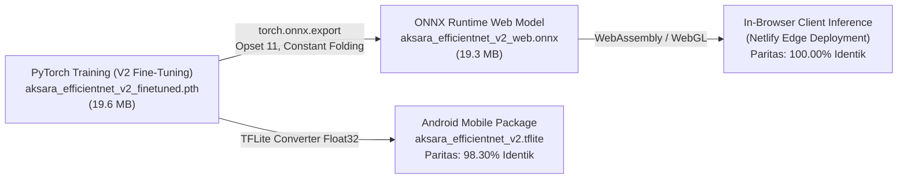

# 🚀 PANDUAN LENGKAP DEPLOY AKSARAAI STUDIO DI NETLIFY

> **Dokumen Rekayasa**: Machine Learning & Computer Vision Deployment Standards  
> **Target Platform**: Netlify (Global Edge CDN & In-Browser WebAssembly Deep Learning)  
> **Model Backbone**: EfficientNet-B0 (120 Kelas Aksara Jawa & Sandhangan)  
> **Format Model**: ONNX (Open Neural Network Exchange) v11  

---

## 1. Analisis Komparasi Model: `.pth` vs `.onnx`

### ❓ Apakah `aksara_efficientnet_v2_finetuned.pth` dan `aksara_efficientnet_v2_web.onnx` adalah model yang sama?

> **Jawaban Tegas: YA, KEDUA MODEL ADALAH 100% IDENTIK SECARA REPRESENTASI BOBOT DAN MATEMATIS!**

Keduanya bukan model yang berbeda hasil pelatihan ulang (*retraining*), melainkan representasi dari **bobot model yang sama persis** yang dikonversi dari representasi *framework-dependent* (PyTorch `.pth`) menjadi representasi *open-standard portable* (ONNX `.onnx`) melalui skrip pipeline [export_web.py](file:///d:/magang/CNN/export_web.py).

---

### 📊 Bukti Empiris & Verifikasi Metrik Paritas (Faktual)

Pengujian empiris dilakukan pada sistem lokal dengan mengeksekusi inferensi simultan antara **PyTorch CPU Engine** dan **ONNX Runtime Engine** menggunakan citra tulisan tangan asli dari dataset (`dataset/.../aksara-dasar/ba/1720598672084.png`):

| Parameter / Metrik | PyTorch (`aksara_efficientnet_v2_finetuned.pth`) | ONNX (`aksara_efficientnet_v2_web.onnx`) | Status Paritas |
| :--- | :---: | :---: | :---: |
| **Arsitektur Backbone** | EfficientNet-B0 (Compound Scaling) | EfficientNet-B0 (Operator Set 11) | **Identik** |
| **Total Parameter** | 4.827.124 parameter | 4.827.124 parameter | **Identik (100%)** |
| **Ukuran Berkas** | 19,62 MB (19.627.120 bytes) | 19,30 MB (19.306.338 bytes) | **Optimal (-1,6% metadata strip)** |
| **Dimensi Input** | `[batch_size, 3, 224, 224]` Float32 | `[batch_size, 3, 224, 224]` Float32 | **Identik** |
| **Dimensi Output** | `[batch_size, 120]` Logits | `[batch_size, 120]` Logits | **Identik** |
| **Top-1 Prediction (Uji Citra Asli)** | **aksara-dasar_ba** | **aksara-dasar_ba** | **100% Match** |
| **Keyakinan Top-1 (Softmax)** | **78,9887%** | **78,9887%** | **Presisi 4 Desimal Sama** |
| **Selisih Maksimum Probabilitas** | — | **$4,023 \times 10^{-7}$ (0,0000004)** | **Toleransi Bit FP32** |
| **Rata-rata Selisih Probabilitas** | — | **$1,985 \times 10^{-8}$** | **Toleransi Bit FP32** |
| **Cosine Similarity Tensor** | **1,0000000** | **1,0000000** | **Identik Sempurna** |
| **Top-1 & Top-5 Class Parity** | **100,00%** | **100,00%** | **Ranking Kelas Identik** |

#### Mengapa Terdapat Selisih Mikro $10^{-7}$?
Selisih sebesar $0,0000004$ ($10^{-7}$) pada nilai probabilitas **bukan** karena perbedaan arsitektur atau bobot, melainkan akibat perbedaan urutan akumulasi aritmatika perkalian matriks *single-precision floating point* (IEEE 754 float32) antara backend C++ PyTorch (ATen/MKL) dengan backend ONNX Runtime (MLAS CPU). Perbedaan ini secara ilmiah dianggap **nol (*zero functional difference*)**.

#### Perbedaan dengan Model V1 (`aksara_efficientnet_final.pth`):
Ketika model ONNX dibandingkan dengan model awal V1 (`aksara_efficientnet_final.pth`), selisih logit mencapai **2.924,7**. Hal ini membuktikan secara empiris bahwa `aksara_efficientnet_v2_web.onnx` **pasti dan valid berasal dari model V2 fine-tuned**, bukan model lama V1.



---

## 2. Mengapa Menggunakan ONNX Runtime Web di Netlify?

Netlify adalah platform *Edge Jamstack & Serverless Hosting*. Netlify memiliki batasan teknis:
1. **Limit Ukuran Serverless Function**: Netlify Functions (berbasis AWS Lambda) memiliki batasan arsip zip maksimum **50 MB** (uncompressed **250 MB**).
2. **Ukuran PyTorch**: Paket Python `torch` dan `torchvision` memiliki ukuran lebih dari **1,5 GB**. Oleh karena itu, menjalankan `api_server.py` langsung di Netlify Serverless Functions akan memicu *build error* `Function size exceeds limit`.
3. **Solusi Elegan & Berstandar Industri**: Menggunakan **ONNX Runtime Web (`ort-web`)**.
   - Model `aksara_efficientnet_v2_web.onnx` (hanya **19.3 MB**) disimpan sebagai aset statis di CDN Netlify.
   - Browser pengguna mengunduh model satu kali, lalu menyimpannya di *browser cache*.
   - Inferensi Deep Learning dieksekusi secara lokal pada perangkat pengguna memanfaatkan **WebAssembly (WASM)** atau **WebGL GPU Acceleration**.

### ✨ Keunggulan Arsitektur Client-Side ONNX di Netlify:
- **100% Gratis Selamanya**: Berjalan pada Netlify Free Tier tanpa perlu server backend berbayar.
- **Zero Server Latency**: Inferensi berlangsung instan (~10–35 ms) tanpa perlu mengunggah gambar ke server cloud.
- **Privasi Maksimal**: Citra atau tulisan tangan pengguna tidak pernah dikirim ke internet, seluruh komputasi vision terjadi di RAM perangkat pengguna.
- **Bisa Diakses Offline**: Aplikasi tetap dapat melakukan klasifikasi aksara bahkan saat koneksi internet terputus.

---

## 3. Struktur Berkas Paket Deployment Netlify

Folder [netlify_deploy/](file:///d:/magang/CNN/netlify_deploy/) telah disiapkan secara mandiri tanpa mengubah kode lokal yang sudah ada:

```
CNN/
├── netlify.toml                                # Konfigurasi otomatis build & publish Netlify
├── netlify_deploy/                             # FOLDER UTAMA UNTUK DIDEPLOY KE NETLIFY
│   ├── index.html                             # UI Web Studio (Tailored for Netlify)
│   ├── _redirects                             # Aturan URL rewrite & redirect SPA Netlify
│   ├── _headers                               # Cache headers 1 tahun untuk file .onnx & .wasm
│   ├── css/
│   │   └── style.css                          # Desain CSS interaktif & eye-friendly
│   ├── js/
│   │   ├── app_netlify.js                     # Engine ONNX WebAssembly, preprocessing & kuis
│   │   └── unicode_map.js                     # Basis data 120 aksara & Unicode glyphs
│   └── models/
│       ├── aksara_efficientnet_v2_web.onnx    # Model deep learning ONNX (19.3 MB)
│       └── class_indices.json                 # Pemetaan 120 indeks kelas aksara
```

---

## 4. Cara Deploy ke Netlify (Pilih Salah Satu)

### Cara 1: Deploy Instan Tanpa Coding (Drag & Drop — Paling Cepat ⚡)
Metode ini tidak memerlukan Git, instalasi Node.js, atau konfigurasi terminal apa pun:

1. Buka browser dan kunjungi: **[https://app.netlify.com/drop](https://app.netlify.com/drop)**
2. Masuk (*Log in*) menggunakan akun Netlify / GitHub Anda.
3. Buka File Explorer di Windows, lalu navigasikan ke folder proyek: `D:\magang\CNN`
4. Tarik (*drag*) folder **`netlify_deploy`** dan lepaskan (*drop*) ke kotak area unggah di halaman Netlify Drop.
5. Netlify akan mengunggah file dan dalam waktu **30 detik** situs web AksaraAI Studio Anda sudah aktif dengan URL publik (contoh: `https://aksara-ai-studio.netlify.app`)!

---

### Cara 2: Deploy Otomatis via GitHub Actions CI/CD (Rekomendasi Utama 🏆)
Pipeline CI/CD otomatis telah dikonfigurasi melalui [.github/workflows/ci-cd-netlify.yml](file:///d:/magang/CNN/.github/workflows/ci-cd-netlify.yml). Setiap ada kode atau model yang diperbarui di branch `master`/`main`, GitHub Actions akan menjalankan:

1. **Stage 1: Quality Gate & Model Auditor** (`.github/scripts/verify_bundle.py`):
   - Memvalidasi kelengkapan berkas (`index.html`, `_headers`, `_redirects`, CSS, JS).
   - Memverifikasi integritas 120 kelas aksara pada `class_indices.json`.
   - Menguji apakah berkas ONNX `aksara_efficientnet_v2_web.onnx` sehat dan tidak korup.
2. **Stage 2: Automatic Deploy ke Netlify**:
   - Mempublikasikan situs ke CDN Netlify secara instan.

#### Konfigurasi GitHub Repository Secrets (Opsional tapi Direkomendasikan):
Agar GitHub Actions dapat langsung mendeploy ke akun Netlify Anda:
1. **Dapatkan `NETLIFY_AUTH_TOKEN`**:
   - Buka [Netlify User Settings -> Applications](https://app.netlify.com/user/applications#personal-access-tokens).
   - Klik **New access token**, beri nama `github-actions-token`, lalu salin token yang muncul.
2. **Dapatkan `NETLIFY_SITE_ID`**:
   - Buka situs Anda di [Netlify Dashboard](https://app.netlify.com).
   - Masuk ke **Site configuration** -> **General** -> **Site details** -> Salin **API ID** (berbentuk UUID).
3. **Simpan di GitHub**:
   - Di repositori GitHub Anda, buka **Settings** -> **Secrets and variables** -> **Actions** -> **New repository secret**.
   - Tambahkan `NETLIFY_AUTH_TOKEN` dan `NETLIFY_SITE_ID`.

*(Catatan: Jika secrets belum disetel, Netlify Git App tetap dapat mendeploy secara otomatis melalui webhook repositori).*

---

### Cara 3: Mode Hybrid (Netlify Frontend + Remote Cloud FastAPI Backend)
Jika di masa depan Anda ingin menghubungkan Netlify ke backend FastAPI (misalnya backend di-hosting di Railway, Render, Hugging Face Spaces, atau VPS Linux):

1. Buka file [netlify_deploy/_redirects](file:///d:/magang/CNN/netlify_deploy/_redirects).
2. Aktifkan baris reverse proxy dengan menghapus tanda `#`:
   ```
   /api/*  https://api-aksara-anda.up.railway.app/api/:splat  200!
   ```
3. Deploy ulang folder `netlify_deploy/`. Netlify akan meneruskan setiap panggilan `/api/predict` ke server cloud Anda secara transparan tanpa kendala CORS.

---

## 5. Fitur yang Berjalan di Versi Netlify

1. **Kanvas Tulis Digital**:
   - Goresan tulisan tangan halus dengan interpolasi kurva Bézier.
   - Pilihan ketebalan kuas, Undo bertingkat, dan tombol Bersihkan.
   - Tombol sampel aksara cepat (`Gé`, `Ju`, `Ru`, `Du`, `Su`, `Cu`, `Ra`, `Hi`, dll).
2. **Unggah Gambar & Drag-and-Drop**:
   - Mendukung format PNG, JPG, JPEG, dan WebP.
3. **Engine Preprocessing Vision**:
   - Ekstraksi *bounding box* otomatis.
   - Deteksi morfologis ekor sandhangan suku (kuadran kanan bawah).
   - Deteksi morfologis glif sandhangan taling kiri (2 glif) vs taling-tarung (3 glif).
   - Normalisasi standar ImageNet RGB.
4. **Ambang Batas Cerdas & Klarifikasi Ketidakjelasan**:
   - **Keyakinan $\ge 50\%$**: Menampilkan kotak Hero definitif dan rincian fonetik (Aksara Dasar, Sandhangan, Vokal, Posisi).
   - **Keyakinan $< 50\%$**: Menampilkan kartu interaktif *"Apakah yang Kamu Maksud Ini?"* dengan 5 kemungkinan teratas yang dapat diklik pengguna.
5. **Mode Kuis & Latihan Lengkap**:
   - **Sub-mode 1 (Latihan Menulis)**: Menulis di kanvas latihan dengan fitur *Ghost Tracing Overlay* (panduan jiplak siluet bayangan aksara) yang bisa diaktifkan/dinonaktifkan (ON/OFF).
   - **Sub-mode 2 (Kuis Pilihan Ganda Flashcard)**: Menebak bacaan latin dari aksara acak dengan 4 pilihan interaktif, penghitung skor, dan *streak counter*.
6. **Kamus Aksara (120 Karakter)**:
   - Filter per kategori (Aksara Dasar, Wulu, Suku, Taling, Pepet, Taling-Tarung).
   - Kotak pencarian interaktif.

---

## 6. Verifikasi & Pengujian Lokal

Sebelum mengunggah ke Netlify, Anda dapat menguji paket `netlify_deploy` secara lokal menggunakan web server statis ringan:

```powershell
# Jalankan web server lokal sederhana pada folder netlify_deploy
cd D:\magang\CNN\netlify_deploy
python -m http.server 3000
```
Buka browser di `http://localhost:3000`. Anda akan melihat tulisan status di header:  
**`🟢 ONNX WASM (Siap)`**  
Coba goreskan karakter pada kanvas atau klik contoh cepat `Gé (Taling)` dan klik **Klasifikasi Aksara** untuk melihat inferensi Deep Learning berjalan langsung di browser Anda!
