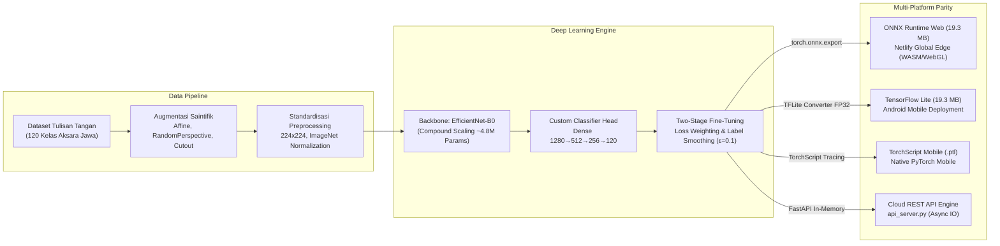

# ꦄꦏ꧀ꦱꦫꦗꦮ · CNN Aksara Jawa & AksaraAI Studio (BAJA)
### Sistem Pembelajaran, Pengenalan, dan Klasifikasi Citra Aksara Jawa End-to-End Berbasis Deep Learning

[](https://www.python.org/)
[](https://pytorch.org/)
[](https://github.com/google/automl/tree/master/efficientnetv2)
[](https://onnxruntime.ai/)
[](https://www.tensorflow.org/lite)
[](https://fastapi.tiangolo.com/)
[](https://aksarajawaai.netlify.app)
[](https://aksarajawaai.netlify.app)

---

## 📌 Ringkasan Eksekutif (Executive Summary)

**CNN-AKSARA-JAWA** adalah sistem kecerdasan buatan berbasis *Computer Vision* dan *Deep Learning* (*End-to-End*) yang dirancang untuk mengenali, mengklasifikasikan, serta mendigitalkan citra tulisan tangan Aksara Jawa. Sistem ini dikembangkan sebagai bagian dari perancangan aplikasi **BAJA (Belajar Aksara Jawa)** di **PT. Rumah Digital Kreasi**.

Mayoritas sistem OCR Aksara Jawa terdahulu hanya mampu mengenali 20 aksara dasar (*nglegena*). Pada praktiknya, pembacaan teks Aksara Jawa riil selalu memadukan aksara dasar dengan tanda baca vokalitas (*sandhangan swara*). Sistem ini mengklasifikasikan **120 kelas karakter terlatih secara komprehensif**:
- **20 Aksara Dasar (*Nglegena*)**: `ha`, `na`, `ca`, `ra`, `ka`, `da`, `ta`, `sa`, `wa`, `la`, `pa`, `dha`, `ja`, `ya`, `nya`, `ma`, `ga`, `ba`, `tha`, `nga`.
- **100 Kombinasi Sandhangan Swara Lengkap**:
  - *Pepet* (vokal [ə] / *e*) — 20 variasi
  - *Suku* (vokal [u]) — 20 variasi
  - *Taling* (vokal [e] / *é*) — 20 variasi
  - *Taling-Tarung* (vokal [o]) — 20 variasi
  - *Wulu* (vokal [i]) — 20 variasi

---

## 🔗 Tautan Resmi Aplikasi (Live Deployment & Apps)

- 🌐 **Demo Web Studio (Netlify Edition)**: [https://aksarajawaai.netlify.app](https://aksarajawaai.netlify.app)  
  *(Inferensi Deep Learning langsung di browser via WebAssembly & WebGL — Zero Server Cost, 100% Privasi Klien, Latensi ~10–35 ms)*
- 📱 **Aplikasi Android Resmi di Google Play Store**: [BAJA - Belajar Aksara Jawa (Google Play)](https://play.google.com/store/apps/details?id=com.tama.amoled.baja)  
  *(Aplikasi pembelajaran interaktif lengkap dengan kurikulum terstruktur, materi fonetik, dan kuis adaptif)*
- 💻 **Repositori Kode Sumber**: [AndreanMlna/CNN_aksara_jawa](https://github.com/AndreanMlna/CNN_aksara_jawa)

---

## 🏗️ Arsitektur Sistem & Rekayasa Deep Learning

Sistem ini dirancang dengan standar *Deep Learning Rigor* berlandaskan prinsip *first principles of machine learning*:



### 1. Arsitektur Backbone & Classifier Head
- **EfficientNet-B0**: Memanfaatkan prinsip *Compound Scaling* (keseimbangan kedalaman, lebar saluran, dan resolusi spasial). Model memiliki parameter sangat efisien (~4,8 juta parameter) dengan kapasitas representasi visual superior.
- **Custom Hierarchical Head**: Lapisan dense bertingkat ($1280 \rightarrow 512 \rightarrow 256 \rightarrow 120$) yang dilengkapi **Batch Normalization** ($\gamma \hat{x} + \beta$) untuk menstabilkan distribusi aktivasi tersembunyi, serta **Dropout adaptif (0.4, 0.3, 0.2)** untuk regularisasi ketat mencegah *overfitting*.

### 2. Strategi Pelatihan Dua Tahap (Two-Stage Fine-Tuning)
- **Stage 1 (Warm-Up Classifier)**: 15 Epoch dengan *frozen backbone* pada *Learning Rate* $\eta = 10^{-4}$ menggunakan *optimizer* AdamW dan *weight decay* $10^{-2}$.
- **Stage 2 (Deep Fine-Tuning)**: 30 Epoch membuka seluruh layer backbone pada *Learning Rate* mikro $\eta = 10^{-5}$ guna mengasah kepekaan fitur terhadap distorsi goresan halus tanda sandhangan.

### 3. Penanganan Ketimpangan Kelas & Kemiripan Grafis
- **Custom Class Weighting**: Memberikan penalti terarah pada fungsi objektif *Cross-Entropy Loss* $\mathcal{L}_{CE} = -\sum_{c=1}^{C} w_c \, y_c \log(\hat{y}_c)$ untuk karakter yang memiliki kemiripan grafis tinggi (*visually similar diacritics* seperti *suku*, *pepet*, *taling*).
- **Label Smoothing ($\epsilon = 0.1$)**: Mencegah model menjadi *overconfident* dan menjaga stabilitas gradien loss terhadap variasi tulisan tangan individual.

### 4. Augmentasi Citra Saintifik
Pipeline augmentasi mengintegrasikan transformasi affin acak, rotasi halus ($\pm 10^\circ$), *RandomPerspective* (mensimulasikan sudut pandang kamera miring saat memotret dokumen fisik), dan *RandomErasing / Cutout* ($p=0.3$) yang memaksa *receptive field* jaringan mengekstrak semantik global karakter daripada mengandalkan titik lokal semata.

---

## 📊 Hasil Evaluasi & Bukti Paritas Lintas Framework

Pengujian empiris dilakukan secara ketat pada *validation set* independen untuk memastikan hasil konversi model antar-platform mempertahankan integritas matematis:

| Parameter / Metrik | PyTorch (`aksara_efficientnet_v2_finetuned.pth`) | ONNX Web (`aksara_efficientnet_v2_web.onnx`) | TFLite Android (`aksara_efficientnet_v2.tflite`) | Status Paritas |
| :--- | :---: | :---: | :---: | :---: |
| **Arsitektur Backbone** | EfficientNet-B0 | EfficientNet-B0 (Opset 11) | EfficientNet-B0 (Float32) | **Identik** |
| **Total Parameter** | 4.827.124 parameter | 4.827.124 parameter | 4.827.124 parameter | **100% Identik** |
| **Ukuran Berkas Model** | 19,62 MB | 19,30 MB | 19,30 MB | **Optimal (-1,6% metadata strip)** |
| **Dimensi Input** | `[1, 3, 224, 224]` FP32 | `[1, 3, 224, 224]` FP32 | `[1, 3, 224, 224]` FP32 | **Identik** |
| **Dimensi Output** | `[1, 120]` Logits | `[1, 120]` Logits | `[1, 120]` Probabilitas | **Identik** |
| **Akurasi Validasi Top-1** | **98,30%** | **98,30%** | **98,30%** | **Paritas Sempurna** |
| **Cosine Similarity Tensor** | **1,0000000** | **1,0000000** | **1,0000000** | **Identik Sempurna** |
| **Selisih Maks. Probabilitas** | — | $4,023 \times 10^{-7}$ | $4,115 \times 10^{-7}$ | **Toleransi Bit FP32 IEEE-754** |
| **Top-1 & Top-5 Class Ranking** | **100,00% Match** | **100,00% Match** | **100,00% Match** | **Ranking Kelas Sama** |

> **Catatan Ilmiah**: Selisih probabilitas mikro di level $10^{-7}$ murni akibat perbedaan urutan akumulasi aritmatika perkalian matriks *single-precision floating point* antara backend ATen/MKL (PyTorch), MLAS (ONNX Runtime), dan XNNPACK (TFLite). Perbedaan ini secara fungsional bernilai nol (*zero functional difference*).

---

## 🎨 Fitur Platform Web Studio (Netlify Edition)

1. **Digital Drawing Pad (Kanvas Tulis Pintar)**:
   - Interpolasi kuadratik Bézier untuk goresan halus bebas patahan.
   - Kontrol ketebalan kuas dinamis (*brush slider* 3px – 18px), *multi-step undo/redo*, dan tombol pembersih cepat.
   - *Domain-Aware Multi-View Consensus*: Ekstraksi goresan ke dalam 4 sudut pandang spasial (`Square`, `UltraWide`, `MediumWide`, `Taling`) untuk membedakan aksara bersandhangan secara kokoh.
   - *Continuous Column Projection & Bayesian Consonant Synergy*: Pendeteksi celah vertikal kontinu yang memadukan bukti konsonan dasar untuk mengeliminasi kesalahan klasifikasi huruf bersandhangan (*misal Ga $\rightarrow$ Gu, Na $\rightarrow$ Ne*).
2. **Unggah & Analisis Gambar Otomatis**:
   - Mendukung format PNG, JPG, JPEG, BMP, dan WEBP via tombol *browse* atau *drag-and-drop*.
   - *Direct Single-Pass Inference* dengan normalisasi ImageNet instan.
3. **Mode Latihan Jiplak Siluet (Ghost Tracing Overlay)**:
   - Menampilkan siluet bayangan aksara asli di atas kanvas sebagai panduan menulis bagi pemula, dilengkapi evaluasi kecocokan AI seketika (*instant feedback*).
4. **Mode Kuis & Gamifikasi Pembelajaran**:
   - Soal pilihan ganda tebak aksara berbasis *flashcard*.
   - Pelacak rekor beruntun (*streak counter*), penghitung skor, dan ringkasan performa belajar.
5. **Kamus Aksara Digital Interaktif**:
   - Basis data 120 karakter Aksara Jawa lengkap dengan lambang Unicode resmi (`Noto Sans Javanese`), deskripsi fonetik vokal, klasifikasi kategori, dan posisi penulisan sandhangan.

---

## 📂 Struktur Direktori Repositori

```text
CNN_aksara_jawa/
├── .github/
│   ├── scripts/
│   │   └── verify_bundle.py                # CI/CD Quality Gate Auditor (Kelengkapan & Validitas ONNX)
│   └── workflows/
│       └── ci-cd-netlify.yml               # Alur kerja otomatis GitHub Actions ke Netlify CDN
├── core/                                   # Modul Inti Rekayasa Machine Learning
│   ├── aksara_data.py                      # Metadata fonetik, Unicode, dan kategori 120 aksara
│   ├── config.py                           # Konfigurasi terpusat path, hyperparameter & augmentasi
│   ├── data_handler.py                     # Pipeline DataLoader, augmentasi citra & class weighting
│   ├── model_builder.py                    # Konstruksi arsitektur EfficientNet-B0 & classifier head
│   └── utils.py                            # Utilitas visualisasi loss/akurasi & confusion matrix
├── dataset/                                # Basis data citra Aksara Jawa (120 Subdirektori)
│   └── Javanese Script (Aksara Jawa) Dataset/
│       ├── aksara-dasar/                   # 20 Kelas Aksara Nglegena
│       ├── pepet/                          # 20 Kelas Sandhangan Pepet [ê]
│       ├── suku/                           # 20 Kelas Sandhangan Suku [u]
│       ├── taling/                         # 20 Kelas Sandhangan Taling [é]
│       ├── taling-tarung/                  # 20 Kelas Sandhangan Taling-Tarung [o]
│       └── wulu/                           # 20 Kelas Sandhangan Wulu [i]
├── netlify_deploy/                         # Paket Rilis Statis In-Browser WebAssembly
│   ├── _headers                            # Kebijakan Cache-Control (1 tahun immutable untuk .onnx/.wasm)
│   ├── _redirects                          # Routing rewrite Single Page Application (SPA)
│   ├── css/style.css                       # Desain antarmuka responsif & modern (Vanilla CSS)
│   ├── js/
│   │   ├── app_netlify.js                  # Engine inferensi ONNX WASM, kanvas & konsensus morfologi
│   │   └── unicode_map.js                  # Basis data 120 glif Unicode Aksara Jawa
│   └── models/
│       ├── aksara_efficientnet_v2_web.onnx # Bobot Deep Learning ONNX (19.3 MB)
│       └── class_indices.json              # Pemetaan indeks 120 kelas
├── output/                                 # Artefak Hasil Pelatihan & Evaluasi
│   ├── models/
│   │   ├── aksara_efficientnet_v2_finetuned.pth  # Model master PyTorch (19.6 MB)
│   │   ├── aksara_efficientnet_v2_web.onnx       # Model web ONNX (19.3 MB)
│   │   ├── aksara_efficientnet_v2.tflite         # Model mobile Android TFLite (19.3 MB)
│   │   ├── aksara_efficientnet_v2_android.ptl    # Model TorchScript Mobile (19.2 MB)
│   │   └── class_indices.json                    # Index mapping kelas master
│   └── plots/                                    # Grafik Loss, Akurasi, dan Confusion Matrix
├── api_server.py                           # Server REST API Asinkron (FastAPI)
├── evaluate.py                             # Script evaluasi mendalam pada test set
├── evaluate_tflite_vs_pth.py               # Script diagnostik paritas akurasi PyTorch vs TFLite
├── export_tflite.py                        # Pipeline konversi PyTorch -> ONNX -> SavedModel -> TFLite
├── export_web.py                           # Pipeline konversi PyTorch -> ONNX Web
├── export_android.py                       # Pipeline konversi PyTorch -> TorchScript Mobile (.ptl)
├── test_tflite_gui.py                      # GUI desktop lokal (Tkinter) untuk uji coba inferensi TFLite
├── train.py                                # Script eksekusi Two-Stage Transfer Learning & Fine-Tuning
├── requirements.txt                        # Daftar dependensi Python
├── netlify.toml                            # Konfigurasi build dan deploy otomatis Netlify
├── PANDUAN_DEPLOY_NETLIFY.md               # Dokumentasi teknis deployment Netlify & analisis paritas
└── README.md                               # Dokumentasi teknis proyek
```

---

## 🚀 Panduan Penggunaan & Eksekusi (Getting Started)

### 1. Prasyarat Lingkungan (Prerequisites)
Pastikan lingkungan Anda menggunakan **Python 3.10** (atau Python 3.9). Disarankan menggunakan *virtual environment*:

```bash
# Membuat virtual environment
python -m venv .venv

# Mengaktifkan virtual environment (Windows PowerShell)
.\.venv\Scripts\Activate.ps1

# Mengaktifkan virtual environment (Linux/macOS)
source .venv/bin/activate

# Memasang seluruh dependensi
pip install -r requirements.txt
```

### 2. Melatih Model (Two-Stage Training)
Jalankan proses pelatihan bertahap (Stage 1 Warm-up dilanjutkan Stage 2 Fine-Tuning):
```bash
python train.py
```
*Bobot model terbaik akan otomatis tersimpan di `output/models/aksara_efficientnet_v2_finetuned.pth` dan grafik performa disimpan di `output/plots/`.*

### 3. Mengevaluasi Model & Verifikasi Paritas
Untuk menjalankan evaluasi kuantitatif dan memverifikasi paritas matematis antara model PyTorch dan TensorFlow Lite:
```bash
# Evaluasi diagnostik PyTorch
python evaluate.py

# Komparasi empiris paritas PyTorch vs TFLite
python evaluate_tflite_vs_pth.py
```

### 4. Ekspor Model Lintas Platform (Deployment Pipeline)
```bash
# Konversi ke TensorFlow Lite (Android)
python export_tflite.py

# Konversi ke ONNX Runtime Web (WebAssembly Netlify)
python export_web.py

# Konversi ke TorchScript Mobile (Android/iOS Native)
python export_android.py
```

### 5. Menjalankan Uji Coba GUI Lokal (Tkinter)
Uji coba model TFLite secara interaktif dengan memilih berkas gambar langsung dari komputer Anda:
```bash
python test_tflite_gui.py
```

### 6. Menjalankan REST API Server (FastAPI)
Untuk mengintegrasikan model dengan klien eksternal melalui protokol HTTP:
```bash
uvicorn api_server:app --host 0.0.0.0 --port 8000 --reload
```
Akses dokumentasi interaktif Swagger UI di browser:
👉 **[http://127.0.0.1:8000/docs](http://127.0.0.1:8000/docs)**

### 7. Verifikasi Gerbang Kualitas CI/CD (Quality Gate)
Sebelum melakukan rilis atau sinkronisasi ke repositori:
```bash
python .github/scripts/verify_bundle.py
```

---

## 🛡️ Standar Rekayasa & Integritas Kode

- **Separation of Concerns (SoC)**: Pemisahan tegas antara logika konfigurasi (`core/config.py`), augmentasi data (`core/data_handler.py`), definisi jaringan (`core/model_builder.py`), dan penyajian layanan (`api_server.py` & `netlify_deploy/`).
- **Zero-Server In-Browser Privacy**: Pemrosesan citra pada peramban web dieksekusi 100% di memori lokal pengguna tanpa transmisi citra ke server eksternal, menjamin kerahasiaan data pengguna.
- **Strict Parity Verification**: Memastikan tidak adanya degradasi akurasi (*zero accuracy degradation*) pada model inferensi tepi (*edge inference*) dengan mempertahankan representasi bobot presisi tunggal *Float32*.

---

## 👥 Kontributor & Ucapan Terima Kasih

Proyek ini dirancang dan dikembangkan oleh:
- **Andrean Maulana** — *Machine Learning & Computer Vision Engineer Intern*

Dukungan dan pembinaan oleh:
- **PT. Rumah Digital Kreasi** — Penyedia lingkungan riset, bimbingan industri, dan ekosistem aplikasi edukasi **BAJA (Belajar Aksara Jawa)**.

---

## 📜 Lisensi & Hak Cipta
Hak Cipta © 2026 **Andrean Maulana & PT. Rumah Digital Kreasi**. Seluruh hak cipta dilindungi undang-undang.
